<br>

```
  CODENAME   :  AI最严厉的父亲
  HANDLE     :  @dashen_wang  ·  dashen.wang
  DIVISION   :  Architecture / Automation / AI Engineering
  RESEARCH   :  AI · System Design · Human Behavior Patterns
  INVESTMENT :  Equities & Crypto Speculation
  LOCATION   :  Technical World [PERMANENT]  ·  Emotional World [TRANSIT]
  CLEARANCE  :  ████████████  LEVEL-S
```

<br>

<div align="center">


[](https://dashen.wang)&nbsp;&nbsp;
[](https://x.com/dashen_wang)&nbsp;&nbsp;
[](https://dashen.wang)

</div>

<br>

---

`AI Engineering` &nbsp;`System Architecture` &nbsp;`LLM Integration` &nbsp;`Automation` &nbsp;`Python` &nbsp;`Claude API` &nbsp;`PBN & SEO` &nbsp;`Crypto`

---

```
  01  连路过的母狗都会撩一下的 AI 工程师
  02  把复杂拆开，把混乱整理成能落地的结构
  03  研究 AI 不研究情怀，研究架构不研究 PPT
  04  投机但不赌命
  05  内容方向：AI，工具，自动化，投机逻辑
  06  常驻技术世界，偶尔经过情绪地
```

---

```
  MAGI SYSTEM  //  CONSENSUS PROTOCOL

  MELCHIOR  ·  APPROVED  ██████████
  BALTHASAR ·  APPROVED  ██████████
  CASPER    ·  APPROVED  ██████████

  VERDICT: EXECUTE
```

<div align="center">
<sub>YOU ARE (NOT) ALONE.</sub>
</div>

